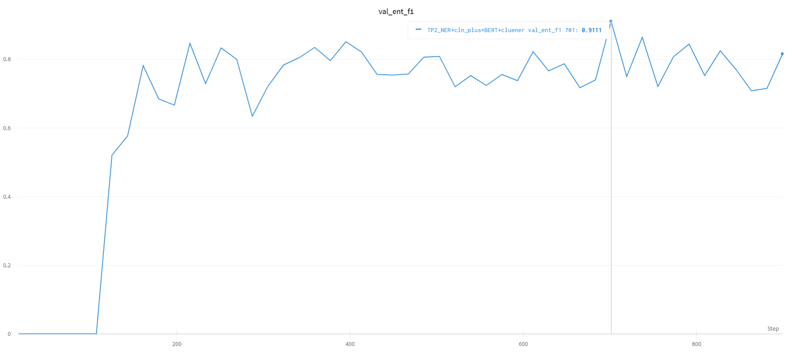

# TPLinker-NER

> 喜欢本项目的话，欢迎点击右上角的**star**，感谢每一个点赞的你。

## 项目介绍

本项目是参考 [TPLinker](https://github.com/131250208/TPlinker-joint-extraction) 中HandshakingTagging思想，将TPLinker由原来的关系抽取(RE)模型修改为命名实体识别(NER)模型。

**【注意】** 事实上，本项目使用的base模型是TPLinker_plus，这是因为若严格地按照TPLinker的设计思想，在NER任务上几乎无法使用。具体原因，在[Q&A](#Q&A)部分有介绍。

TPLinker-NER相比于之前的序列标注、半指针-半标注等NER模型，更加有效的解决了实体嵌套问题。因为TPLinker本身在RE领域已经取得了优异的成绩，而TPLinker-NER作为从中提取的子功能，理论上效果也会太差。
由于本人拥有的算力有限，无法在大规模语料库上进行试验，此次只在 [CLUENER](https://github.com/CLUEbenchmark/CLUENER2020) 数据集上做了实验。



**Best F1 on dev: 0.9111**

## Update
* 2021-06-03:中文NER任务可以尝试更换预训练模型，一般会有提升。笔者实验所用预训练模型为`chinese_wwm_ext` 。

## Usage

### 实验环境

本次实验进行时Python版本为3.6，其他主要的第三方库包括：
* pytorch==1.8.1
* wandb==0.10.26 #for logging the result
* glove-python-binary==0.1.0
* transformers==4.1.1
* tqdm==4.54.1
  
**NOTE:** 
1. [wandb](https://docs.wandb.ai/) 是一款优秀的机器学习可视化库。本项目默认未启用wandb，如果想使用wandb管理日志，请在`tplinker_plus_ner/config.py`文件中修改相关配置即可。
2. 如果你使用的Windows系统且尚未安装`Glove`库，或者只想用`BERT`作编码器，主文件请使用`train_only_bert.py`。

### 数据准备

#### 格式要求

TPLinker-NER约定数据集的的格式如下：
* 训练集`train_data.json`与验证集`valid_data.json`
```json
[
    {
        "id":"",
        "text":"原始语句",
        "entity_list":[{"text":"实体","type":"实体类型","char_span":"实体char级别的span","token_span":"实体token级别的span"}]
    },
    ...
]
```
* 测试集`test_data.json`
```json
[
    {
        "id":"",
        "text":"原始语句"
    },
    ...
]
```

#### 数据转换

如果需要将其他格式的数据集转换到TPLinker-NER，请参考`raw_data/convert_dataset.py`的转换逻辑。

#### 数据存放

准备好的数据需放在`data4bert/{exp_name}`或`data4bilstm/{exp_name}`中，其中`exp_name`为`tplinker_plus_ner/config.py`中配置的实验名。

### 预训练模型与词向量

请下载Bert的中文预训练模型[bert-base-chinese](https://huggingface.co/bert-base-chinese)存放至`pretrained_models/`，并在`tplinker_plus_ner/config.py`中配置正确的`bert_path`。

如果你想使用BiLSTM，需要准备预训练word embeddings存放至`pretrained_emb/`，如何预训练请参考`preprocess/Pretrain_Word_Embedding.ipynb`

### Train

请阅读`tplinker_plus_ner/config.py`中的内容，并根据自己的需求修改配置与超参数。

然后开始训练
```bash
cd tplinker_plus_ner
python train.py
```

### Evaluation

你仍然需要在`tplinker_plus_ner/config.py`中配置Evaluation相关参数。**尤其注意`eval_config`中的`model_state_dict_dir`参数值与你所用的日志模块一致。**

然后开始Evaluate
```
cd tplinker_plus_ner
python evaluate.py
```

## Q&A

> 以下问题为个人在改写项目的想法，仅供参考，如有错误，欢迎指正。

1. 为什么TPLinker不适合直接用在NER上，而要用TPLinker_plus?
   
   个人理解：讨论这个问题就要先了解最初的TPLinker设计模式，除了HandShaking外，作者还预定义了三大种类型`ent, head_rel, tail_rel`，每个类型下又有子类型，`ent:{"O":0,"ENT-H2T":1}, head_rel:{"O":0, "REL-SH2OH":1, "REL-OH2SH":2}, head_tail:{"O":0, "REL-ST2OT":1, "REL-OT2ST":2}`。在模型实际做分类时，三大类之间是独立的。以`head_rel`为例，其原数据整理得y_true矩阵shape为`(batch_size, rel_size, shaking_seq_len)`，这里`rel_size`即有多少种关系。模型预测的结果y_pred矩阵shape为`(batch_size, rel_size, shaking_seq_len, 3)`。可以想象，这样的y_true矩阵已经很稀疏了，只有`0,1,2`三种标签。而如果换做NER，这样`(batch_size, ent_size, shaking_seq_len)`的矩阵将更加稀疏（只有`0,1`两种标签），对于一个`(ent_size,shaking_seq_len)`的矩阵来说，可能只有1至2个地方为1，这将导致模型无限地将预测结果都置为0，从而学习失败（事实实验也是这样）。作者在TPLinker中是如何解决这一问题的呢？其实作者用了个小trick回避了这一问题，具体做法是不再区分实体的类型，将所有实体都看作是`DEFAULT`类型，这样就把y_true压缩成了`(batch_size,shaking_seq_len)`，降低了矩阵的稀疏性。作者对于这一做法的解释是"Because it is not necessary to recognize the type of entities for the relation extraction task since a predefined relation usually has fixed types for its subject and object."，即实体类别信息对关系抽取不太重要，因为每种关系某种程度上已经预定义了实体类型。**综上，如果想直接把TPLinker应用到NER上是不合适的。**

   而TPLinker_plus改变了这一做法，他不再将`ent, head_rel, tail_rel`当做三个独立任务，而是将所有的关系与标签组合，形成一个大的标签库，只用一个HandShaking矩阵表示句子中的所有关系。举个例子，假设有以下3个关系(或实体类型)：`主演、出生于、作者`，那么其与标记标签`EH-ET,SH-OH,OH-SH,ST-OT,OT-ST`组合后会产生15种tag，这极大地扩充了标签库。相应的，TPLinker_plus的输入也就变成了`(batch_size,shaking_seq_len,tag_size)`。这样的改变让矩阵中的非0值相对增多，降低了矩阵的稀疏性。**（这只是一方面原因，更加重要原因的请参考问题2）**

2. TPLinker_plus还做了哪些优化？
   * 任务模式的转变：从问题1最后的结论可以看出，TPLinker_plus扩充标签库的同时，也将模型任务由原来的多分类任务转变成了多标签分类任务，即每个句子形成的`shaking_seq`可以出现多个的标签，且出现的数量不确定。形如
   ```python
   # 设句子的seq_len=10，那么shaking_seq=55
   # 标签组合有8种tag_size=8
   [
       [0,0,1,0,1,0,1,0],
       [1,0,1,0,0,0,0,1],
       ...
       # 剩下的53行
   ]
   ```
   * 损失函数：对于多标签分类问题，原本的损失函数不再适用。作者使用了一种新的损失函数，关于这个损失函数原理，可以参考苏神的文章[将“softmax+交叉熵”推广到多标签分类问题](https://kexue.fm/archives/7359) **(先点个star再走呀😁)**

3. TPLinker-NER中几个关键词怎么理解?
   
   对于一个text中含有n个token的情况
    * `shaking_matrix`：`n*n`的矩阵，若`shaking_maxtrix[i][j]=1`表示从第i个token到第j个token为一个实体。（实际用到的只有上三角矩阵，以为实体的起始位置一定在结束位置前。）
    * `matrix_index`：上三角矩阵的坐标，`(0,0),(0,1),(0,2)...(0,n-1),(1,1),(1,2)...(1,n-1)...(n-1,n-1)`。
    * `shaking_index`：上三角矩阵的索引，长度为$\frac{n(n+1)}{2}$，即`[0,1,2,...,n(n+1)/2 - 1]`
    * `shaking_ind2matrix_ind`：将索引映射到矩阵坐标，即`[(0,0),(0,1),...,(n-1,n-1)]`
    * `matrix_ind2shaking_ind`：将坐标映射到索引，即
        ```
        [[0, 1, 2,    ...,        n-1],
        [0, n, n+1, n+2,  ...,  2n-2]
        ...
        [0, 0, 0, ...,  n(n+1)/2 - 1]]
        ```
    * `spot`：一个实体对应的起止span和类型id，例如实体“北京”在矩阵中起始位置在7，终止位置在9，类型为LOC"(id:3)，那么其对应`spot`为(7, 9, 3)。

## 致谢

* 感谢TPLinker开源项目作者[Andy Wong](https://github.com/131250208)


